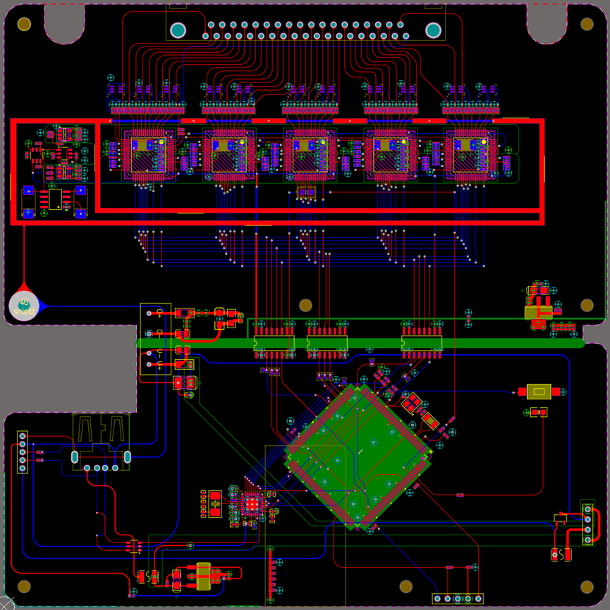
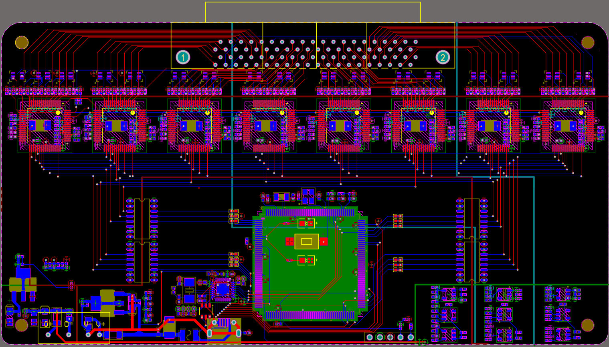

Codes for 40/64-channel EEG acquisition device, stm32h743iit6_ads1299_virtual_serial_port.

The experimental code presented herein is developed within the CubeMX and Visual Studio (STM32 for VSCode) development environments. It utilizes the ADS1299 chip for the acquisition of electroencephalogram (EEG) signals, with the STM32H743IIT6 serving as the primary control unit. High-speed USB communication with the host is established through the USB3300. This project is exploratory in nature and will undergo further expansion and updates. In addition to its data acquisition capabilities, the code also incorporates preliminary features such as chip error reporting, device performance testing, and other functionalities.

By modifying the configuration of the ADS1299 registers and adjusting the data length in the USB buffer, the conversion between two distinct devices is accomplished. Specificall, change the following function to send the size of the packet, currently 5 * 24, changed to 8 * 24. And add the last three chips of the register to read and write procedures.
USBD_CUSTOM_HID_SendReport_HS(reg_buffer, 120);

40 channel EEG acquisition device

64 channel EEG acquisition device

